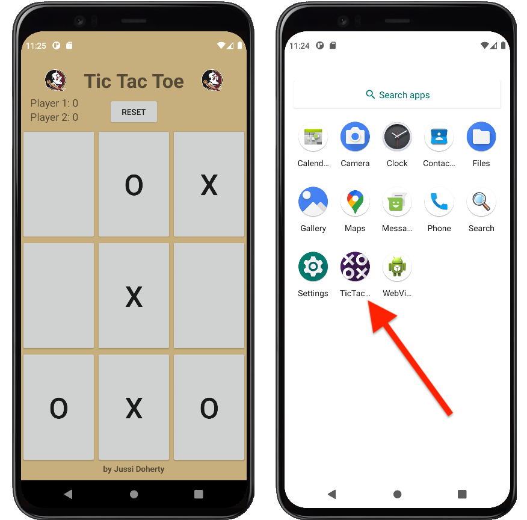

# TicTacToe

## TicTacToe
Jussi Doherty
COP 4656 - Mobile Programming - Fall 2020
Java 11

This tic-tac-toe game was developed using Android Studio. Layout includes the standard 9x9 grid, a score board, and a reset button. 
Play against the computer!

## Source
The following code is a derivative work of the code from Coding in Flow, provided freely for all at
https://codinginflow.com/tutorials/android/tic-tac-toe/
